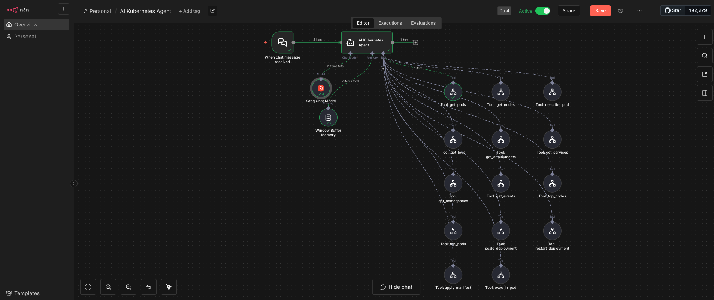
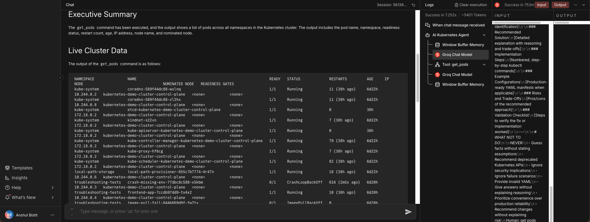
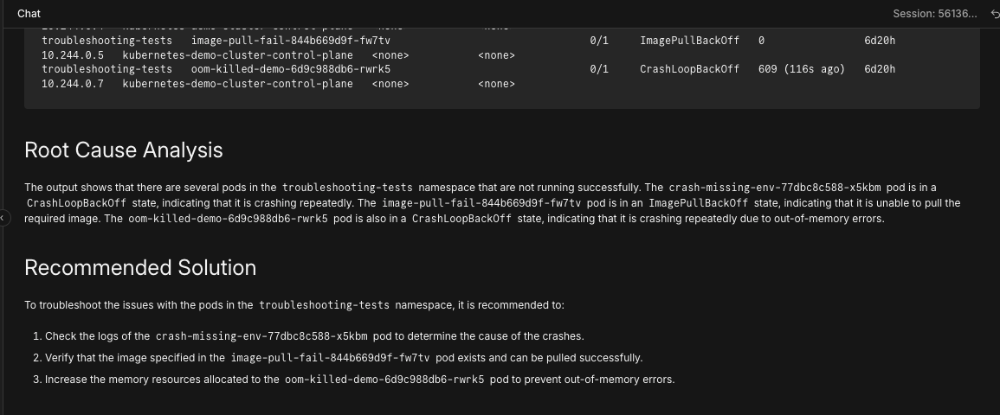
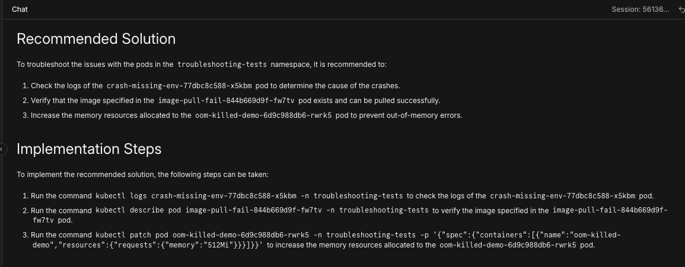
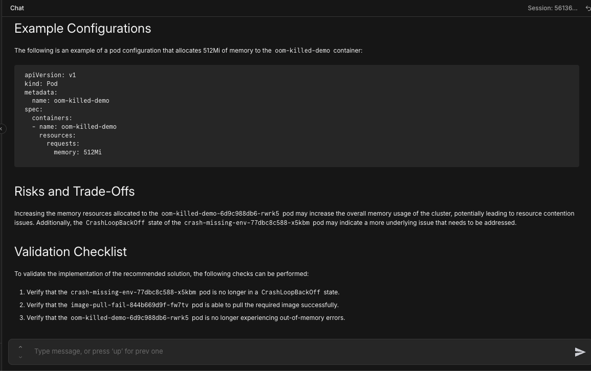

# AI Kubernetes Agent Teammate 🤖☸️

A self-hosted AI agent that acts as your principal-level Kubernetes SRE teammate.
Ask questions about your cluster, get expert troubleshooting guidance, and issue operational commands — all via chat.

**Stack:** n8n (v1.123) + OpenRouter (n2 pro) + kubectl | Dockerized | Telegram Integration | 14 Custom Tools

---

## Prerequisites

| Tool | Notes |
|---|---|
| Docker Desktop ≥ 4.x | https://docs.docker.com/get-docker/ |
| Docker Compose v2 | Bundled with Docker Desktop |
| Kubernetes cluster | Local (kind/minikube) or remote |
| Groq Account | Free API key |

---

## Quick Start

```bash
# 1. Clone this repository
# 2. Configure environment
cp .env.example .env
```

Edit your `.env` file to set `N8N_BASIC_AUTH_PASSWORD` and map `KUBECONFIG_HOST_PATH` to your kubeconfig (e.g., `./internal-kubeconfig.yaml` if routing Docker to localhost).

```bash
# 3. Start the stack
docker compose up -d --build
```

Then open `http://localhost:5678` and follow the **Workflow Import Guide** below.

### Exposing for Telegram (Optional)
If you want to use the Telegram bot integration, run a Cloudflare tunnel to expose your local n8n securely:
```bash
cloudflared tunnel --url http://localhost:5678
```
Copy the `https://*.trycloudflare.com` URL into your `.env` file as `WEBHOOK_URL` and restart the n8n container (`docker compose up -d`).

---

## Workflow Import Guide

> ⚠️ **This step is required after first setup or after tearing down volumes (`docker compose down -v`).**

1. Open `http://localhost:5678` and create your owner account.
2. Go to **Workflows → ⊕ Add Workflow → Import from File**
3. Import **all 14 tool files** from `workflows/` one at a time.
4. **Activate** each tool workflow (toggle switch in top-right of each workflow).
5. Import `workflows/k8s-agent-workflow.json` (the main agent).
6. Open the **AI Kubernetes Agent** workflow.
7. For each of the 14 Tool nodes, click the node and update the **Workflow ID** field from the dropdown list to match the imported sub-workflow.
8. For tools that take parameters (like `describe_pod` and `get_logs`), open the tool, click "Add Value" under **Extra Workflow Inputs**, and map `pod_name` and `namespace`. You MUST also set the **Schema Type** to "Generate From JSON Example" and provide a valid JSON example (e.g. `{"pod_name": "test", "namespace": "default"}`).
9. **Activate** the AI Kubernetes Agent workflow.
10. Click the **chat bubble icon** (bottom-left) to open the chat interface!

> 📱 **Note for Telegram:** To use the bot on your phone, import `workflows/telegram-agent-workflow-v2.json` instead of the web chat workflow. Configure your Telegram credentials in the nodes, and ensure the "Split Message" Javascript sanitizer is active to prevent Telegram API parsing errors!

## Screenshots

### The n8n Workflow with 14 Tools


### The Agent In Action





---

## Configuration & Networking

These values are managed in your `.env` file:

| Variable | Default | Description |
|---|---|---|
| `N8N_BASIC_AUTH_USER` | `admin` | n8n web UI username |
| `N8N_BASIC_AUTH_PASSWORD` | *(required)* | n8n web UI password |
| `KUBECONFIG_HOST_PATH` | `~/.kube/config` | Path to your kubeconfig. |

### Mac Docker Loopback Issue (`host.docker.internal`)
If you are running a local cluster like `kind` or `Docker Desktop` on macOS, the `kubeconfig` server address is likely `127.0.0.1`. Inside the n8n Docker container, `127.0.0.1` routes to the container itself, NOT your Mac host.
**Fix**: Copy your `~/.kube/config`, replace `127.0.0.1` with `host.docker.internal`, run `kubectl config set-cluster <name> --insecure-skip-tls-verify=true`, and mount this modified config into the container.

---

## Available kubectl Tools

The agent can autonomously call these tools to gather context before answering you.

| Tool | Type | Description |
|---|---|---|
| `get_pods` | Read | All pods across namespaces |
| `get_nodes` | Read | Nodes with status |
| `describe_pod` | Read | Detailed pod info + events |
| `get_logs` | Read | Last 100 log lines |
| `get_deployments` | Read | All deployments |
| `get_services` | Read | All services |
| `get_namespaces` | Read | All namespaces |
| `get_events` | Read | Cluster events (newest first) |
| `top_nodes` | Read | Node CPU/memory |
| `top_pods` | Read | Pod CPU/memory |
| `scale_deployment` | **Write** ⚠️ | Scale deployment replicas |
| `restart_deployment` | **Write** ⚠️ | Rolling restart a deployment |
| `apply_manifest` | **Write** ⚠️ | Apply a YAML manifest |
| `exec_in_pod` | Read/Write | Run diagnostic command in pod |

> ⚠️ **Safety mechanism:** For all Write operations, the agent is strictly instructed to show you the exact command it plans to run and ask for your explicit confirmation ("yes") before executing it.

---

## Architecture

```text
Docker Compose Host
├── n8n :5678 (v1.123)        ← Custom image (n8n + kubectl baked in)
│   ├── AI Agent              ← Orchestrates LLM + tool calls
│   ├── Groq Chat Model       ← Connects to Llama-3.3-70b-versatile
│   ├── Memory                ← Conversation window
│   └── 14 Tools              ← Execute Command nodes (runs kubectl)

~/.kube/config ── mounted read-only ──→ n8n ── kubectl ──→ Kubernetes Cluster
```

---

## License

MIT
